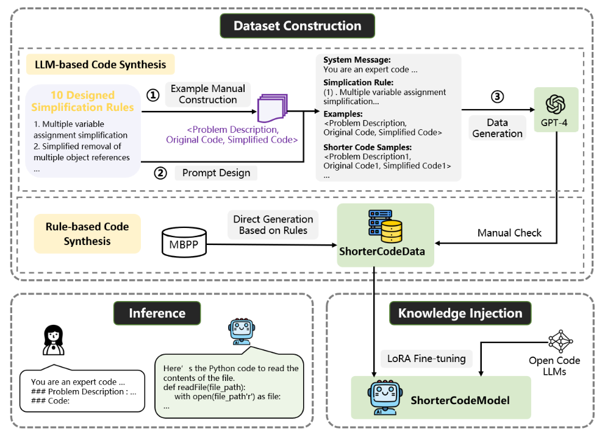

# ShorterCode

We propose a novel approach to generate shorter code using LLMs.


Our contributions can be summarized as follows:

## Source code 
### Environment
```
```

### Data

```
cd dataset
```

#### Fine-tuning


```
python finetune.py \
--base_model 'codellama/CodeLlama-7b-Instruct-hf' \
--data_path '../dataset/train.jsonl' \
--output_dir '../output' \
--batch_size 256 \
--micro_batch_size 16 \
--num_epochs 2 \
--val_set_size 0.1

```

#### Reference

```
python inference.py \
--load_8bit \
--base_model 'codellama/CodeLlama-7b-Instruct-hf' \
--lora_weights '../output'
 
```
